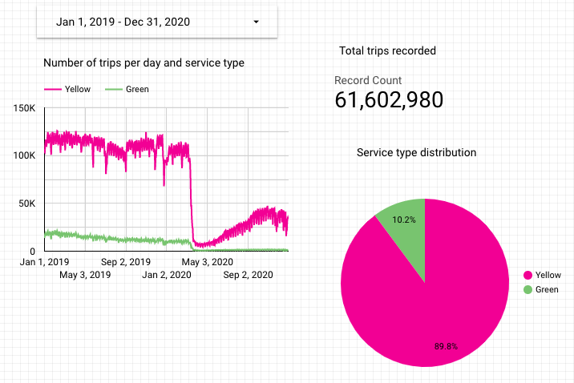
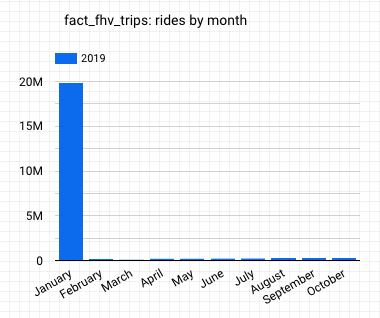

Question #1

SELECT count(*) FROM `third-impact-338912.dbt_arahim.fact_trips`
WHERE DATE(pickup_datetime) between '2019-01-01' and '2020-12-31'

Question #2

Question #3

SELECT count(*) FROM `third-impact-338912.dbt_arahim.stg_fhv_tripdata`

Question #4

SELECT count(*) FROM `third-impact-338912.dbt_arahim.fact_fhv_trips` 
WHERE DATE(pickup_datetime) between '2019-01-01' and '2019-12-31'

Question #5

